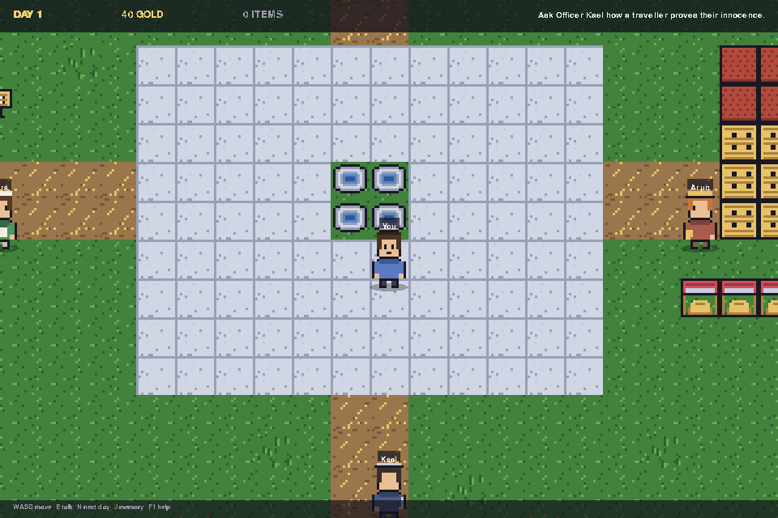
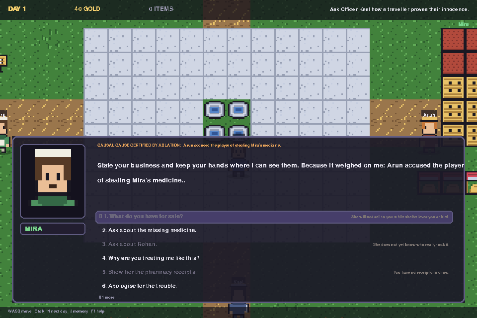
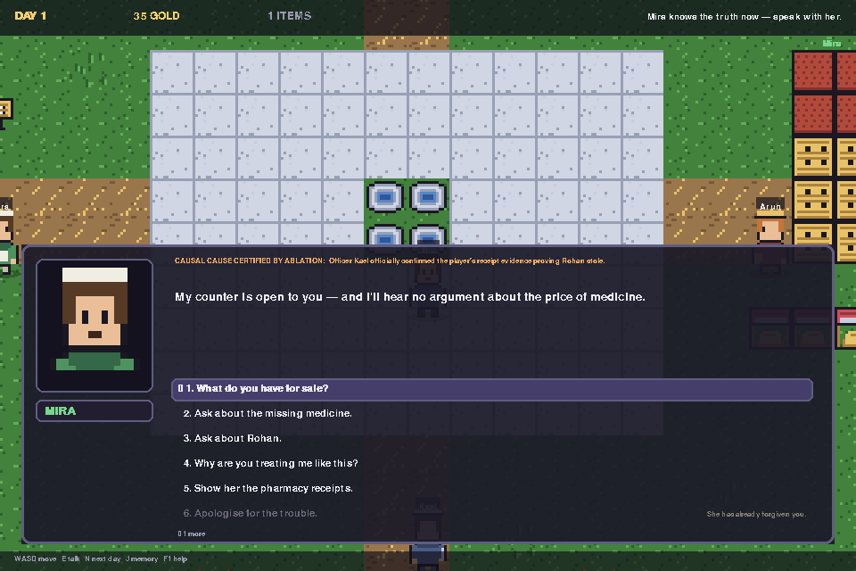
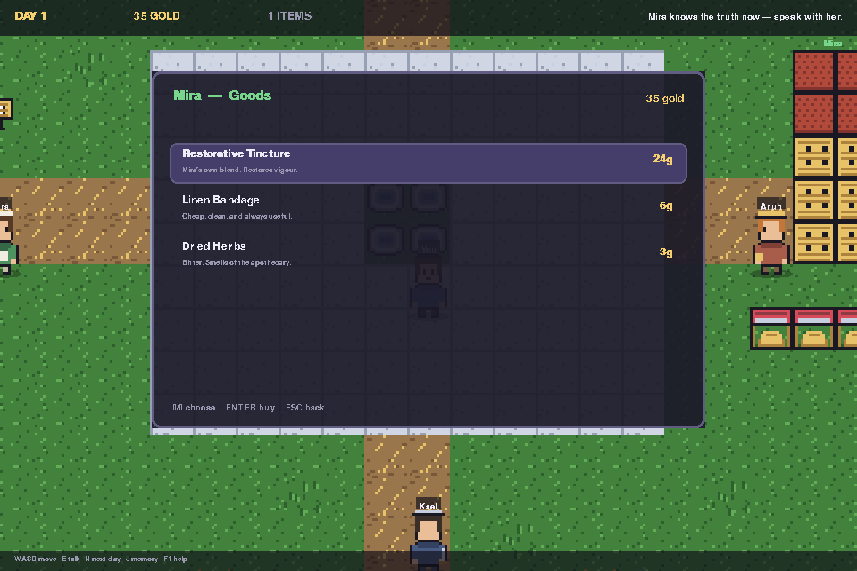
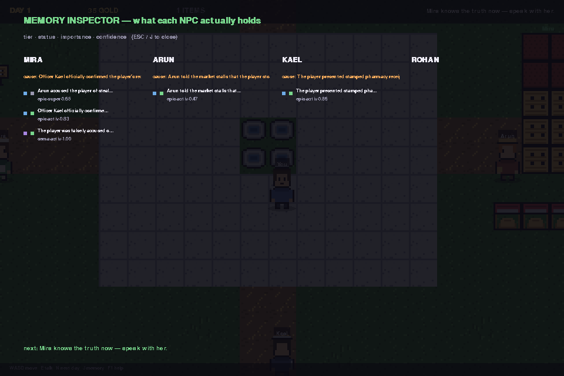

# Selective Hierarchical Memory for Faithful Explainable NPC Decision-Making

A runnable research prototype for NPCs that remember selectively, revise beliefs
when testimony contradicts itself, choose actions under game-state validity
constraints, and *prove* which memories caused the choice.

Version **0.3.0** — adds the playable pygame town on top of the audited core.
See [CHANGELOG-AUDIT.md](CHANGELOG-AUDIT.md) for the v0.2.1 audit fixes and
[CHANGELOG.md](CHANGELOG.md) for the game release.

The decision core is **dependency-free** (Python standard library only) and runs
**without an LLM**. An LLM can be attached, optionally, for dialogue polish only —
and its output is rejected unless it passes a grounding check against the
certified causal factors.

## Quick start

```bash
python -m venv .venv
source .venv/bin/activate          # Windows: .venv\Scripts\activate
pip install -e ".[dev]"

python -m npc_memory_project.demo.shopkeeper_demo        # narrative walkthrough
python -m npc_memory_project.evaluation.benchmark        # evaluation suite
pytest                                                    # 73 tests
```

## Playable pixel-art town (pygame)

```bash
pip install -e ".[game]"
npc-memory-game                 # or: python -m npc_memory_project.game.app
```



A 2D pixel-art town — Ashfen — where you walk up to townsfolk and hold
conversations, Genshin-style: a portrait, a name plate, typewritten speech, and
a numbered list of replies. **The replies are not scripted flavour text.** Each
one is generated from that NPC's live memory store, and the orange tag above the
speech names the memory the counterfactual verifier certified as the cause of
their decision.

Day 1, she will not sell to you — and the reply is greyed out for a reason you
can read:



Resolve the case and the same conversation changes:



| Control | Action |
|---|---|
| WASD / arrows | walk |
| E / SPACE / ENTER | talk to the nearby townsfolk |
| UP / DOWN | pick a reply |
| 1 – 9 | jump straight to a reply |
| mouse | hover and click replies |
| N | sleep and advance a day |
| J / TAB | memory inspector |
| F1 | help · ESC close |

### Quests and shops



Townsfolk gate what they offer on what they believe and what you carry:

* **Mira the apothecary** will not open her counter while she believes the theft
  accusation. Ask her *why* and she cites the exact memory behind it.
* **Kael the guard** explains how a traveller proves innocence: the market keeps
  copies of every apothecary sale. He does not arrest you — the arrest rule
  needs a warrant, a wanted flag or a permit.
* **Arun the vendor** sells apples, bread, and *rumours*. Buying a rumour hands
  you his top memory as hedged speech, e.g. *"I believe — Arun told the market
  stalls that the player stole Mira's medicine. (day 1, 60 % sure)"*. He also
  sells the **market ledgers** — that purchase is what gives you the receipts.
* **Rohan the suspect** is cornered in the alley. Push him and he confesses;
  Kael records it and Mira's belief revises through the normal updater.

Then Mira apologises, trades, and the cause tag still reads *the guard proved
Rohan was the thief* — which is the research claim, playable.

### Memory inspector



`J` shows every NPC's actual store: tier dots (working / episodic / semantic /
archive), status dots (active / corroborated / disputed / superseded / expired),
importance and confidence. Mira keeps the **superseded** accusation alongside the
guard's proof — history is preserved, not overwritten.

Headless for CI or screenshotting:

```bash
npc-memory-game --screenshot out.png --scene dialogue
```

## Interactive web simulator

```bash
python -m npc_memory_project.web.server --port 8080
# then open http://127.0.0.1:8080
```

A browser canvas town with four NPCs (Mira the apothecary, Kael the guard, Arun the
vendor, Rohan the suspect) and a live *Explainable AI inspector*:

| Panel | What it shows |
|---|---|
| Memory heat map | working / episodic / semantic / archive counts, live |
| Memory matrix | every held record with tier, status (active / disputed / superseded / corroborated), importance |
| Utility bars | per-action score with the factor breakdown that produced it |
| Counterfactual card | click a memory to ablate it and watch the decision change |
| Dialogue card | the spoken line, its certified causal reason, and whether an LLM was involved |

**Controls:** WASD / arrow keys / click to move, walk up to an NPC and press
`E` to interact, or use the action hotbar (talk, present evidence, confront
Rohan, spread a rumour). "Advance Day" runs the memory lifecycle, consolidation
and scripted scenario beats.

**Try this:** talk to Mira on Day 1 (she refuses to trade — Arun's accusation is
active), advance three days, then talk again. She apologises, and the
counterfactual card shows that ablating the guard's evidence flips her decision
back to `trade`.

Server options: `--host` (default `127.0.0.1`; use `0.0.0.0` to expose),
`--port`, `--cors` (off by default — the bundled UI is same-origin and does not
need it), `--single-threaded`. Environment equivalents: `NPC_HOST`, `NPC_PORT`,
`NPC_CORS`.

### Optional LLM dialogue

The core never calls a model. Set an OpenAI-compatible endpoint to enable
paraphrasing of the deterministic persona templates:

```bash
export NPC_LLM_API_KEY=sk-...                      # optional for local servers
export NPC_LLM_ENDPOINT=http://localhost:11434/v1/chat/completions
export NPC_LLM_MODEL=llama3
```

Every paraphrase is checked against the certified causal factors before it is
used. If it drops or invents facts, the model output is discarded and the
deterministic line stands; the UI shows which path was taken
(`deterministic` / `llm_verified` / `llm_rejected`).

## Research flow

```
PLAYER / WORLD EVENT
        ↓
Decision-Impact Memory Filter        I(E) = .30|R| + .25Em + .20Q + .15N + .10C
        ↓
Hierarchical Memory Manager          working / episodic / semantic / archive
        ↓
Contradiction-Aware Belief Updater   superseded / corroborated / disputed
        ↓
Relevant Memory Retrieval            relevance, importance, recency, confidence
        ↓
State-Valid Action Filter            rank, arrest warrant, stock, money
        ↓
Utility Decision Engine              argmax over valid actions
        ↓
Counterfactual Explanation Verifier  leave-one-out ablation (+ derivation lineage)
        ↓
NPC ACTION + CERTIFIED EXPLANATION
```

Every NPC action passes the valid-action layer, every important decision writes a
trace, and explanations are built only from factors that survived ablation.

## Evaluation

`python -m npc_memory_project.evaluation.benchmark` reports four things:

**1. Pipeline contract checks** — assert *properties* (the certified cause, when
ablated, must change the action) rather than magic constants.

**2. Invariant suite** over 60 seeded scenarios, run against this architecture and
against a flat, status-blind memory stream as a baseline:

| invariant | SHM | flat baseline |
|---|---|---|
| I1 active exoneration suppresses punishment | 38/38 | 29/38 |
| I2 active accusation + non-positive trust suppresses warmth | 12/12 | 9/12 |
| I3 disputed belief changes nothing | 13/13 | 12/13 |
| **total** | **63/63 (100%)** | **50/63 (79.4%)** |

Scenarios carry ambient noise memories so retrieval pressure is real; without
them a status-blind stream looks as good as a selective one. This is evidence
that belief-status filtering and tiering matter — it is not evidence that the
utility weights are good.

**3. Latency by layer** (mean):

| layer | ms |
|---|---|
| `engine.decide()` only, no I/O | 0.02 |
| store read + retrieve + decide | 0.08 |
| full interaction (I/O + ablation + dialogue) | 0.26 |

**4. Footprint**, measured on real objects: held records vs the top-5 actually
retrieved per decision, in characters plus a whitespace-token proxy. No real
tokenizer is bundled, and the number is reported as a proxy rather than as a
token count. (v0.2 reported a 64.0% reduction derived from a hardcoded
"45 tokens per event" assumption.)

**What the suite does not establish:** one NPC role, one scenario family,
hand-authored invariants, no human playtest ground truth, no comparison to an LLM
memory baseline, and text size rather than context-window cost.

## Layout

```
src/npc_memory_project/
  core/            models + explicit causal feature channel
  memory/          admission filter, tier manager, semantic consolidation
  beliefs/         contradiction-aware belief revision
  decision/        valid-action filtering + utility engine
  explainability/  counterfactual verifier, explanation generator, dialogue
  social/          rumour diffusion with provenance chains
  persistence/     SQLite store (thread-safe)
  simulation/      multi-NPC town orchestration
  evaluation/      seeded scenario harness + benchmark
  web/             HTTP server + canvas simulator and XAI inspector
  game/            playable pygame town (pixel-art, dialogue, shops)
tests/             73 tests
docs/              architecture notes + IEEE paper draft
```

## Status and honesty notes

* The bundled scenario is the paper's "Mira" benchmark (a false theft
  accusation, later exonerated). Scripted beats live in
  `TownSimulation._apply_scripted_events`.
* `metadata["feature_key"]` is the explicit channel that lets semantic beliefs
  influence decisions; the legacy `event_type` keyword scan is retained as a
  fallback. `CLAIM_FEATURES` in `core/features.py` is scenario vocabulary and
  belongs in scenario data, not library code.
* Ablation is a *deletion* counterfactual ("the NPC had forgotten this") over
  retrieved memories only — trust, personality and world flags are never
  ablated. Explanations cover the memory contribution to a decision, not the
  whole decision.
* No licence was shipped with v0.2; an MIT licence is included here — change or
  remove it if that is not your intent.
