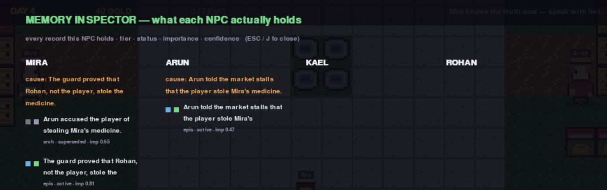
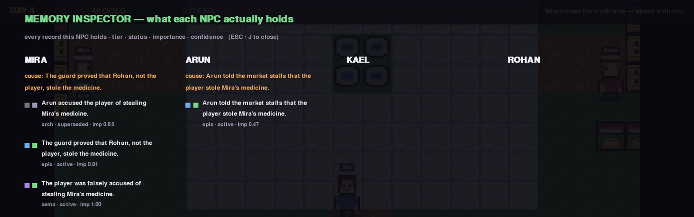
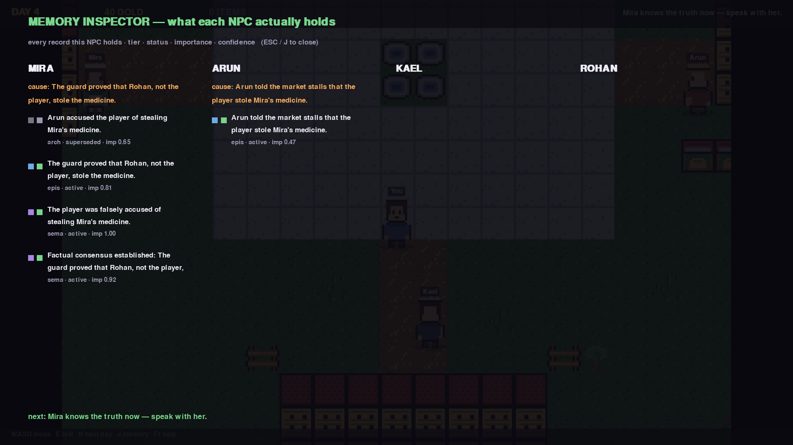
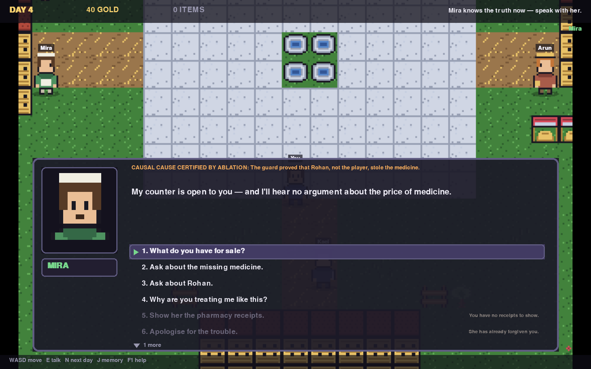

# Selective Hierarchical Memory for Faithful Explainable NPC Decision-Making

A runnable research prototype for NPCs that remember selectively, revise beliefs
when testimony contradicts itself, choose actions under game-state validity
constraints, and *prove* which memories caused the choice.

Version **0.3.0** — adds the playable pygame town on top of the audited core.
See [CHANGELOG-AUDIT.md](CHANGELOG-AUDIT.md) for the v0.2.1 audit fixes and
[CHANGELOG.md](CHANGELOG.md) for the game release.

The decision core is **dependency-free** (Python standard library only) and runs
**without an LLM**. An LLM can be attached, optionally, for dialogue polish only —
and its output is rejected unless it passes a grounding check against the
certified causal factors.

## Quick start

```bash
python -m venv .venv
source .venv/bin/activate          # Windows: .venv\Scripts\activate
pip install -e ".[dev]"

python -m npc_memory_project.demo.shopkeeper_demo        # narrative walkthrough
python -m npc_memory_project.evaluation.benchmark        # evaluation suite
pytest                                                    # 73 tests
```

## Playable pixel-art town (pygame)

```bash
pip install -e ".[game]"
npc-memory-game                 # or: python -m npc_memory_project.game.app
```


A 2D pixel-art town — Ashfen — where you walk up to townsfolk and hold
conversations, Genshin-style: a portrait, a name plate, typewritten speech, and
a numbered list of replies. **The replies are not scripted flavour text.** Each
one is generated from that NPC's live memory store, and the orange tag above the
speech names the memory the counterfactual verifier certified as the cause of
their decision.

Day 1, she will not sell to you — and the reply is greyed out for a reason you
can read:


Resolve the case and the same conversation changes:


| Control | Action |
|---|---|
| WASD / arrows | walk |
| E / SPACE / ENTER | talk to the nearby townsfolk |
| UP / DOWN | pick a reply |
| 1 – 9 | jump straight to a reply |
| mouse | hover and click replies |
| N | sleep and advance a day |
| J / TAB | memory inspector |
| **F11** | **fullscreen** |
| **F10** | **cycle window size (1x → 2x)** |
| drag window edge | the view scales to fit and letterboxes |
| F1 | help · ESC close |

### Window size, fullscreen, and why the text stays sharp

Frames are drawn in two passes:

1. **world** -- tiles, characters, shadows, drawn to a fixed 960x640 logical frame
   and scaled into your window. Blocky on purpose; that is pixel art.
2. **UI** -- HUD, dialogue, shop, memory inspector and help, drawn *after* the
   world is scaled, straight onto the window at its real resolution. Fonts are
   created at their final pixel height, so they are never resampled.

```bash
npc-memory-game                          # 960x640 window
npc-memory-game --scale 2                # 1920x1280
npc-memory-game --window 1600x900        # exact size, letterboxed to fit
npc-memory-game --fullscreen             # start fullscreen
npc-memory-game --screenshot big.png --scene dialogue --window 1600x1000
```

In-game: **F11** toggles fullscreen, **F10** cycles 1x / 1.25x / 1.5x / 2x, and
dragging the window edge resizes live.

The two passes exist because of a real bug. When the whole frame was scaled -- as
it was in v0.4.0 -- a 13 px label on a 1400x933 window went through a 1.46x
resample and turned to mush, and the memory inspector became unreadable:

| before: the panel was part of the scaled frame | after: the panel is drawn at window resolution |
|---|---|
|  |  |

At 1920x1080 the inspector now uses the whole window rather than the letterboxed
column, and lists as many records as fit:



Dialogue at a non-integer window size (1600x1000), the case that used to be
worst:



Layout is scale-invariant: panel text wraps to the same lines at every window
size, so resizing never re-flows a conversation mid-sentence.

### Quests and shops


Townsfolk gate what they offer on what they believe and what you carry:

* **Mira the apothecary** will not open her counter while she believes the theft
  accusation. Ask her *why* and she cites the exact memory behind it.
* **Kael the guard** explains how a traveller proves innocence: the market keeps
  copies of every apothecary sale. He does not arrest you — the arrest rule
  needs a warrant, a wanted flag or a permit.
* **Arun the vendor** sells apples, bread, and *rumours*. Buying a rumour hands
  you his top memory as hedged speech, e.g. *"I believe — Arun told the market
  stalls that the player stole Mira's medicine. (day 1, 60 % sure)"*. He also
  sells the **market ledgers** — that purchase is what gives you the receipts.
* **Rohan the suspect** is cornered in the alley. Push him and he confesses;
  Kael records it and Mira's belief revises through the normal updater.

Then Mira apologises, trades, and the cause tag still reads *the guard proved
Rohan was the thief* — which is the research claim, playable.

### Memory inspector


`J` shows every NPC's actual store: tier dots (working / episodic / semantic /
archive), status dots (active / corroborated / disputed / superseded / expired),
importance and confidence. Mira keeps the **superseded** accusation alongside the
guard's proof — history is preserved, not overwritten.

Headless for CI or screenshotting:

```bash
npc-memory-game --screenshot out.png --scene dialogue
npc-memory-game --screenshot day1.png --scene dialogue --day 1     # before the resolution
npc-memory-game --screenshot big.png --scene memory --window 1920x1080
```

`--screenshot` always saves the presented window: at 1x that is the 960x640
frame, and at any larger size the same frame with its sharp UI pass on top.

## Interactive web simulator

```bash
python -m npc_memory_project.web.server --port 8080
# then open http://127.0.0.1:8080
```

A browser canvas town with four NPCs (Mira the apothecary, Kael the guard, Arun the
vendor, Rohan the suspect) and a live *Explainable AI inspector*:

| Panel | What it shows |
|---|---|
| Memory heat map | working / episodic / semantic / archive counts, live |
| Memory matrix | every held record with tier, status (active / disputed / superseded / corroborated), importance |
| Utility bars | per-action score with the factor breakdown that produced it |
| Counterfactual card | click a memory to ablate it and watch the decision change |
| Dialogue card | the spoken line, its certified causal reason, and whether an LLM was involved |

**Controls:** WASD / arrow keys / click to move, walk up to an NPC and press
`E` to interact, or use the action hotbar (talk, present evidence, confront
Rohan, spread a rumour). "Advance Day" runs the memory lifecycle, consolidation
and scripted scenario beats.

**Try this:** talk to Mira on Day 1 (she refuses to trade — Arun's accusation is
active), advance three days, then talk again. She apologises, and the
counterfactual card shows that ablating the guard's evidence flips her decision
back to `trade`.

Server options: `--host` (default `127.0.0.1`; use `0.0.0.0` to expose),
`--port`, `--cors` (off by default — the bundled UI is same-origin and does not
need it), `--single-threaded`. Environment equivalents: `NPC_HOST`, `NPC_PORT`,
`NPC_CORS`.

### Optional LLM dialogue

The core never calls a model. Set an OpenAI-compatible endpoint to enable
paraphrasing of the deterministic persona templates:

```bash
export NPC_LLM_API_KEY=sk-...                      # optional for local servers
export NPC_LLM_ENDPOINT=http://localhost:11434/v1/chat/completions
export NPC_LLM_MODEL=llama3
```

Every paraphrase is checked against the certified causal factors before it is
used. If it drops or invents facts, the model output is discarded and the
deterministic line stands; the UI shows which path was taken
(`deterministic` / `llm_verified` / `llm_rejected`).

## Research flow

```
PLAYER / WORLD EVENT
        ↓
Decision-Impact Memory Filter        I(E) = .30|R| + .25Em + .20Q + .15N + .10C
        ↓
Hierarchical Memory Manager          working / episodic / semantic / archive
        ↓
Contradiction-Aware Belief Updater   superseded / corroborated / disputed
        ↓
Relevant Memory Retrieval            relevance, importance, recency, confidence
        ↓
State-Valid Action Filter            rank, arrest warrant, stock, money
        ↓
Utility Decision Engine              argmax over valid actions
        ↓
Counterfactual Explanation Verifier  leave-one-out ablation (+ derivation lineage)
        ↓
NPC ACTION + CERTIFIED EXPLANATION
```

Every NPC action passes the valid-action layer, every important decision writes a
trace, and explanations are built only from factors that survived ablation.

## Evaluation

Two entry points. `python -m npc_memory_project.evaluation.report --all` prints the
retrieval comparison, the ablation table and the scaling table in about three
seconds; `docs/EVALUATION.md` holds the current numbers with their limitations.
`python -m npc_memory_project.evaluation.benchmark` reports the four measurements
below.

Headline comparison against five retrieval baselines, on a 21-case author-labelled
set and the 63-check invariant suite:

| method | labelled | invariants |
|---|---|---|
| SHM (this architecture) | 21/21 | 63/63 |
| status-aware, no tiers | 21/21 | 63/63 |
| importance-only | 20/21 | 62/63 |
| recency+importance (status-blind) | 20/21 | 62/63 |
| tiers, status-blind | 20/21 | 62/63 |
| recency-only | 19/21 | 48/63 |

**Read this honestly.** The cases are labelled by the system author, not by human
raters, and every confidence interval except recency-only's touches zero: at this
sample size the architecture is *not* statistically distinguishable from an
importance-ranked baseline. The one component that survives ablation is belief
**status** filtering; removing the tier hierarchy or the semantic tier costs
nothing measurable on either instrument, and `help`/`rumour`/`confession` are
unexercised feature channels. `docs/EVALUATION.md` section 2 has the full ablation
and section 4 the decision-engine defect this instrument caught.

### Does it remember, months later?

The instruments above freeze time, so v0.5.0 runs the clock: 120 simulated days
through the real pipeline (`admit -> revise -> lifecycle -> consolidate`), probed at
days 5/10/20/40/80/120.

| policy | exoneration timeline | accused timeline |
|---|---|---|
| **SHM (this architecture)** | **100%** (decisive memory retrieved: 100%) | **100%** (100%) |
| no semantic tier / no tiers / status-blind | 100% | 100% |
| recency only | 100% -- **but its decisive memory was retrieved 0% of the time** | **0%** |

Three things fall out of that table, all in `docs/EVALUATION.md` section 6:

* **Retention holds.** An exoneration verified on day 3 still governs the decision on
  day 120, and an accusation never retracted still closes the counter on day 120.
* **Accuracy alone would have flattered total amnesia.** recency-only scores 100% on
  the exoneration timeline while retrieving nothing relevant at all -- it answers
  "warm" because it has no signal. Only the decisive-retrieval column exposes it.
* **The tier hierarchy is provably redundant with belief status.** At day 120 the
  store holds 243 records; 236 are archived, and **236 of those 236 are also
  superseded or expired**, so the archive filter excludes a strict subset of what the
  status filter excludes. Either filter alone reproduces every result in this
  repository.

### What the exclusions are actually for

If archival never changes a decision but always shrinks the reachable set, then it is
a *cost* mechanism -- and v0.5.0 cashes that in. `memory/index.py` keeps the
retrievable subset of each NPC's store up to date, and the simulation drives it from
its write hooks:

| store | records | reachable | per-decision retrieval |
|---|---|---|---|
| day-120 retention store | 243 | 7 | 0.025 ms -> **0.006 ms (4.0x)** |
| 60 NPCs x 50 records | 3,000 | 8 | 0.067 ms -> **0.007 ms (9.1x)** |
| one NPC, 4,800 records | 4,800 | 896 | 1.249 ms -> 0.700 ms (1.8x) |

Every row is checked for *identical results* against a brute-force scan before its
speedup is reported. That check is not decoration: the first implementation silently
dropped duplicate `event_id`s and returned a different top-5, and the check failed the
row instead of publishing a 7.2x "speedup" that was really a correctness bug.

**1. Pipeline contract checks** — assert *properties* (the certified cause, when
ablated, must change the action) rather than magic constants.

**2. Invariant suite** over 60 seeded scenarios, run against this architecture and
against a flat, status-blind memory stream as a baseline:

| invariant | SHM | flat baseline |
|---|---|---|
| I1 active exoneration suppresses punishment | 38/38 | 29/38 |
| I2 active accusation + non-positive trust suppresses warmth | 12/12 | 9/12 |
| I3 disputed belief changes nothing | 13/13 | 12/13 |
| **total** | **63/63 (100%)** | **50/63 (79.4%)** |

Scenarios carry ambient noise memories so retrieval pressure is real; without
them a status-blind stream looks as good as a selective one. This is evidence
that belief-status filtering and tiering matter — it is not evidence that the
utility weights are good.

**3. Latency by layer** (mean):

| layer | ms |
|---|---|
| `engine.decide()` only, no I/O | 0.02 |
| store read + retrieve + decide | 0.08 |
| full interaction (I/O + ablation + dialogue) | 0.26 |

**4. Footprint**, measured on real objects: held records vs the top-5 actually
retrieved per decision, in characters plus a whitespace-token proxy. No real
tokenizer is bundled, and the number is reported as a proxy rather than as a
token count. (v0.2 reported a 64.0% reduction derived from a hardcoded
"45 tokens per event" assumption.)

**What the suite does not establish:** one NPC role, one scenario family,
hand-authored invariants and author-written case labels, no human playtest ground
truth (the protocol to obtain it is written but has not been run -- see
`docs/HUMAN_EVAL_PROTOCOL.md`), no comparison to an LLM memory baseline, and text
size rather than context-window cost.

## Layout

```
src/npc_memory_project/
  core/            models + explicit causal feature channel
  memory/          admission filter, tier manager, consolidation, retrieval index
  beliefs/         contradiction-aware belief revision
  decision/        valid-action filtering + utility engine
  explainability/  counterfactual verifier, explanation generator, dialogue
  social/          rumour diffusion with provenance chains
  persistence/     SQLite store (thread-safe)
  simulation/      multi-NPC town orchestration
  evaluation/      harness, baselines, ablation, scaling, retention,
                   indexing, stats, report CLI
  web/             HTTP server + canvas simulator and XAI inspector
  game/            playable pygame town (pixel-art, dialogue, shops)
tests/             134 tests
docs/              architecture notes, evaluation results, human-eval protocol, IEEE paper draft
```

## Status and honesty notes

* The bundled scenario is the paper's "Mira" benchmark (a false theft
  accusation, later exonerated). Scripted beats live in
  `TownSimulation._apply_scripted_events`.
* `metadata["feature_key"]` is the explicit channel that lets semantic beliefs
  influence decisions; the legacy `event_type` keyword scan is retained as a
  fallback. `CLAIM_FEATURES` in `core/features.py` is scenario vocabulary and
  belongs in scenario data, not library code.
* Negative results are reported as found: the tier hierarchy and the semantic tier
  contribute nothing measurable to any decision in the current suite, while the
  `theft` channel carries almost all of the signal (`docs/EVALUATION.md` section 2).
  Section 6.3 goes further and proves the tier filter is redundant with belief status:
  every archived record is also superseded or expired.
* The retrieval index is the one place tiers and status *do* pay off -- as a bound on
  how much of the store a decision has to scan, not as a change to any decision.
* v0.4.0 fixed a decision-engine defect the evaluation found: the `cautious`
  personality trait was an ungated bonus on the punitive actions, so a cautious
  shopkeeper warned the player with no accusation on file. It is now gated on the
  presence of a threat, which leaves every previously correct scenario unchanged.
* Ablation is a *deletion* counterfactual ("the NPC had forgotten this") over
  retrieved memories only — trust, personality and world flags are never
  ablated. Explanations cover the memory contribution to a decision, not the
  whole decision.
* No licence was shipped with v0.2; an MIT licence is included here — change or
  remove it if that is not your intent.
